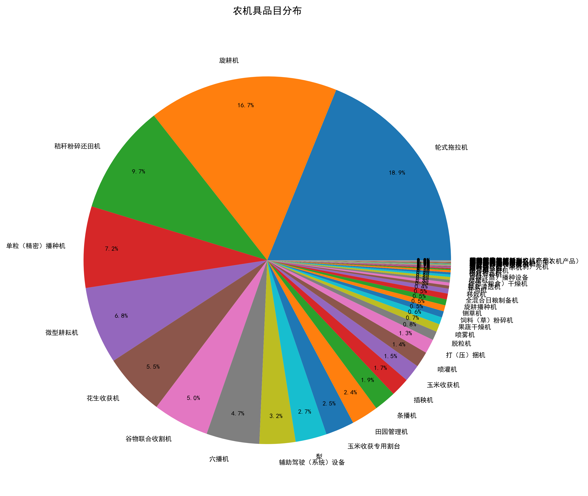
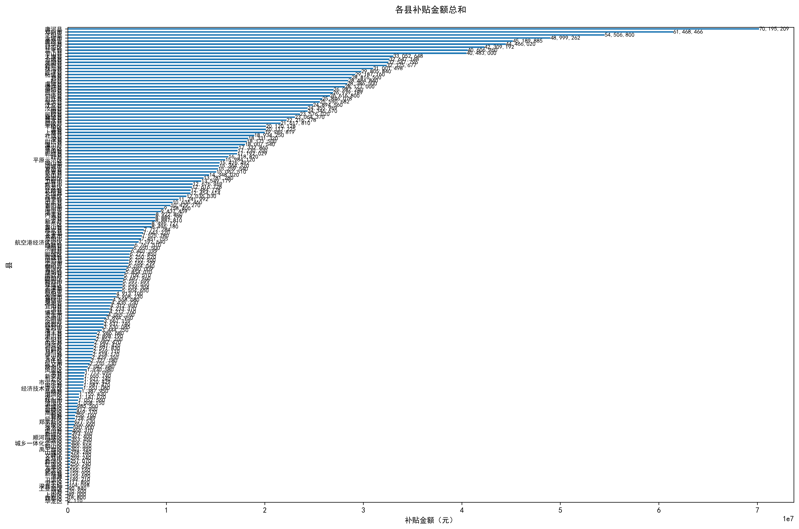
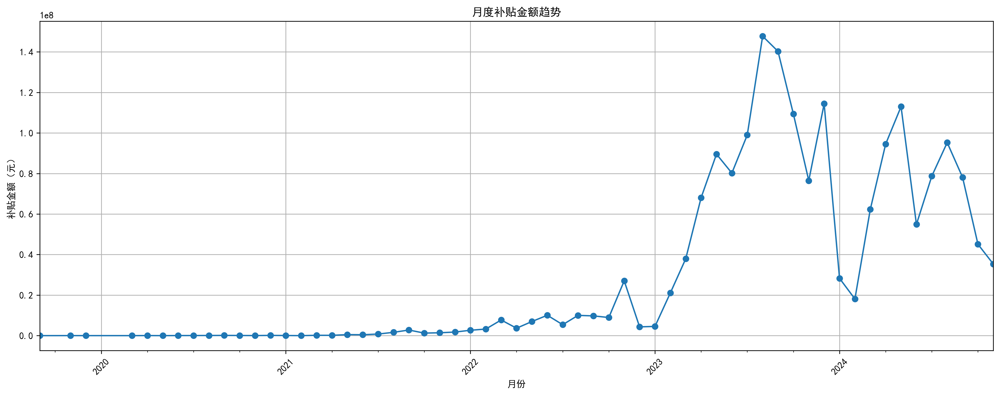
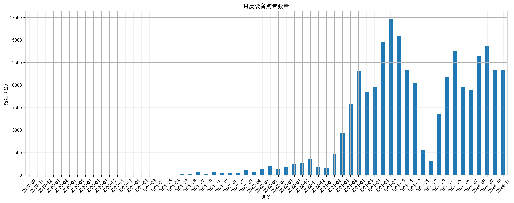
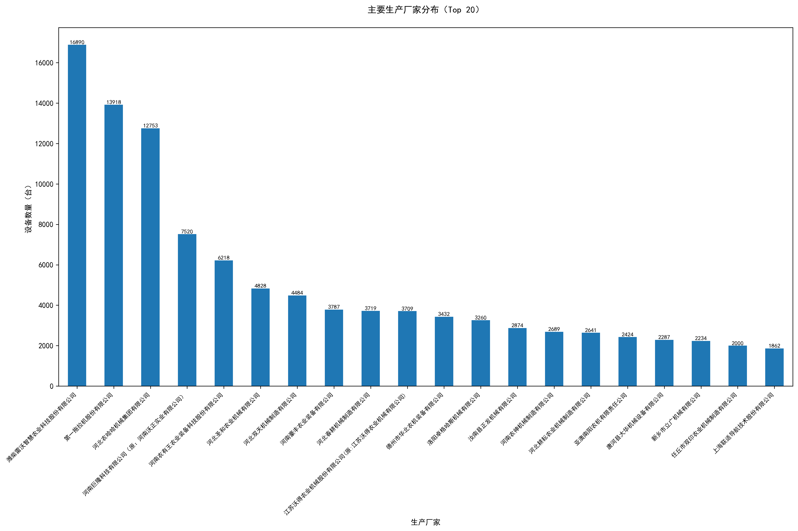
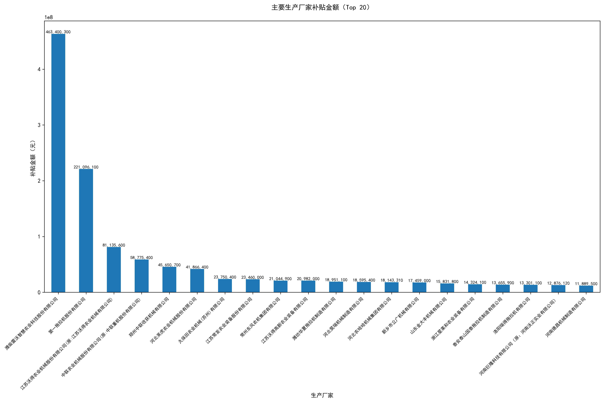

# 河南省农机购置补贴数据分析系统

## 项目简介
本项目是一个专门用于抓取和分析河南省农机购置补贴数据的综合系统。通过网络爬虫技术获取公开数据，并进行多维度的数据分析和可视化，为农业机械化政策制定和执行提供数据支持。

## 功能特点
- 自动化数据采集
  * 多线程并发爬虫
  * 自动错误重试
  * 分批数据保存 
  * 完整的日志记录

- 数据处理与整合
  * 多文件合并
  * 数据清洗
  * 格式标准化
  * 多线程处理

- 数据可视化与分析
  * 机具品目分布分析
  * 各县补贴情况统计
  * 时间趋势分析
  * 生产厂家分析
  * 数据导出Excel

## 技术栈
- Python 3.7+
- 核心依赖：
  * requests：网络请求
  * beautifulsoup4：HTML解析
  * pandas：数据处理
  * matplotlib：数据可视化
  * seaborn：统计图表
  * openpyxl：Excel处理

## 项目结构

henan/ 

├── main.py # 主爬虫程序 

└── visual.py # 数据分析和可视化 

└── README.md # 项目文档


## 安装说明
1. 克隆项目
```bash
git clone https://github.com/rongzhiy/henan-agri-subsidy.git
cd henan-agri-subsidy 
```

2. 安装依赖包
```bash
pip install requests beautifulsoup4 pandas matplotlib seaborn openpyxl
```

3. 运行爬虫程序
```bash
python main.py
```

4. 运行可视化程序
```bash
python visual.py
```

## 分析结果
系统将在 analysis_results 目录下生成以下内容：








[统计分析数据.xlsx](./analysis_results/统计分析数据.xlsx)


## 数据来源

    * 数据来源：河南省农业农村厅
    * 数据类型：农机购置补贴公示数据
    * 数据时间范围：2021-2024年
    * 数据规模：约23万条记录

## 注意事项

    * 请合理控制爬虫速率，避免对目标网站造成压力
    * 建议使用代理池进行数据采集
    * 大规模数据处理时注意内存管理
    * 请遵守相关法律法规，合理使用公开数据

## 联系方式
如果您有任何问题或建议，欢迎通过邮件或Github Issues联系我。

## 参考资料

- [河南省农机购置与应用补贴信息实时公开](http://222.143.21.233:20181/21To23/pub/gongshi)
  
声明：本仓库不参与任何商业行为，仅供学习交流使用，如有侵权，请联系本人删除。
