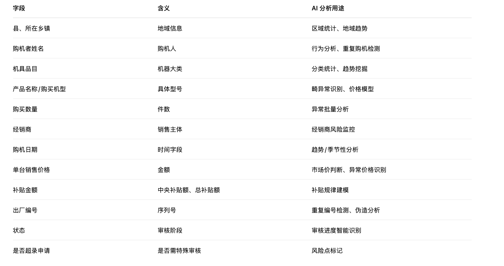

## 《农机补贴业务数据智能分析与 AI 处理需求文档》

### 一、项目背景

当前农机购置补贴业务数据结构复杂，涉及补贴金额、机具类型、乡镇分布、经销商、购机者、购机日期等多维度信息。各级监管部门需要对补贴发放情况进行透明、公正、及时的监管。

传统人工统计方式效率低、不及时、不准确，无法满足现代化农业补贴监管需求。
因此，需要对现有补贴数据进行 智能化分析与 AI 建模，以支持精准监督、异常识别、风险预警和辅助决策。


### 二、AI 数据分析目标

#### 目标 1：构建农机补贴数据智能分析平台

通过算法与可视化实现补贴数据的自动化分析，包含：
- 补贴金额统计分析
- 农机类型趋势分析
- 区域（乡镇）补贴分布分析
- 农机品牌及经销商贡献度分析
- 购机者行为分析（购买频率、类型偏好）


#### 目标 2：AI 驱动的异常检测与风险识别

基于大模型 + 规则 + 统计检测，识别：
- 重复购机
- 同一购机者短期内高频申报
- 异常补贴金额（超限额、价格异常）
- 经销商中的异常行为（忽然激增、价格系统性偏离）
- 机器编号异常（不符合编号格式、重复编号）
- 乡镇之间补贴申请不均衡预警


#### 目标 3：智能问答与自然语言报告生成

引入 AI 大模型实现：

（1）数据智能问答

例如：
```
“2024 年四通镇补贴最多的机具是什么？”
“旋耕机平均补贴金额是多少？”
“哪些经销商在 2024 年销量最高？”
```


（2）自动生成监管周报/月报

AI 自动生成：
- 趋势变化
- 异常事件汇总
- 各乡镇排名
- 品类发展走势
- 预测下阶段补贴需求

#### 目标 4：补贴审核智能辅助

AI 结合历史数据可用于辅助判断：
- 单台价格是否明显异常
- 补贴金额是否合理
- 是否属于疑似超录
- 出厂编号是否重复/伪造
- 购机行为是否满足政策条件

三、数据字段需求与含义映射


### 四、AI 模型需求

1. 异常检测模型（Anomaly Detection）

适用算法：
- Isolation Forest
- One-Class SVM
- DBSCAN 聚类离群识别
- XGBoost 分类模型（基于历史审核数据）

用途：
- 异常价格检测
- 异常补贴金额检测
- 异常购机数量检测
- 序列号重复/特征不一致检测

---

2. 补贴金额预测模型（Regression Model）

用于：
- 判断当前销售价格是否合理
- 判断补贴金额是否符合补贴标准
- 判断经销商报价是否异常

可选算法：
- RandomForestRegressor
- LightGBM
- XGBoostRegressor

---

3. 时间序列预测模型（Time-Series Forecasting）

用于预测：
- 各乡镇未来一段时间的补贴需求量
- 各品类机器需求趋势（旋耕机、拖拉机等）
- 经销商销量预测

可选模型：
- Prophet
- ARIMA
- LSTM

---

4. 智能问答系统（LLM + 数据检索）

技术架构：
- 大模型（如 GPT/LLM）
- RAG（检索增强生成）
- 数据库（MySQL / PostgreSQL）
- Query SQL 自动生成

功能：
- 用自然语言询问数据
- 自动生成分析 SQL
- 可视化图表自动生成

---

5. 审核辅助模型

基于政策规则 + 历史数据训练：
- 判断是否符合补贴申请条件
- 判断是否存在伪造或虚假申报
- 自动给出审核建议与风险评分

### 五、可视化及输出需求

系统应至少包含：

1. 乡镇补贴热力图

展示补贴金额按地域分布。

2. 机具品目占比饼图

如：旋耕机、拖拉机占比多少。

3. 经销商销售量排行

Top 10 排行。

4. 补贴金额趋势图（按月/季度）

5. 异常记录列表（高风险记录）
 - 重复购机
 - 高额补贴
 - 编号异常
 - 经销商异常

---

### 六、可扩展的 AI 业务场景
1.	自动审核材料 OCR → 结构化提取 → 自动对账数据
2.	购机发票照片识别 + 装置识别
3.	自动校验出厂编号是否合法
4.	语音问答：监管人员可语音查询数据
5.	AI 自动生成决策报告

### 七、可能的 Python 实现模块示例（仅结构，不含执行代码）
```aiignore
import pandas as pd
from sklearn.ensemble import IsolationForest
from prophet import Prophet

# 1. 加载
df = pd.read_csv("data.csv")

# 2. 异常检测
model = IsolationForest(contamination=0.02)
df["price_anomaly"] = model.fit_predict(df[["单台销售价格"]])

# 3. 时间序列预测
ts = df.groupby("购机日期")["购买数量"].sum().reset_index()
ts.columns = ["ds", "y"]
m = Prophet()
m.fit(ts)
future = m.make_future_dataframe(30)
forecast = m.predict(future)
```